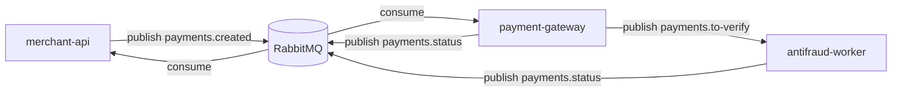

# 💳 Payment Gateway Simulator (em construção)

> Projeto educacional e modular para simular o fluxo de um **gateway de pagamentos assíncrono** com **RabbitMQ** e **Spring Boot**.

## 🧠 Visão Geral

A aplicação é composta por **múltiplos serviços independentes**, comunicando-se via **mensageria (AMQP)**.  
Atualmente, o projeto inclui:

| Módulo | Descrição | Status |
|--------|------------|:------:|
| 🧾 **contracts** | Define os contratos de eventos (`PaymentCreatedEvent`, `PaymentStatusEvent`, enums) | ✅ Concluído |
| 🏪 **merchant-api** | API do lojista. Cria pagamentos e publica `payments.created` no RabbitMQ | ✅ Concluído |
| 🏦 **payment-gateway** | Recebe `payments.created`, aprova valores até R$200, envia `payments.status` | 🚧 Em desenvolvimento |
| 🔍 **antifraud-worker** | Analisa transações acima de R$200 e define `APPROVED` ou `DECLINED` | 🚧 Em desenvolvimento |

---

## ⚙️ Arquitetura



- Comunicação **100% assíncrona** via RabbitMQ.  
- Padrão de eventos inspirado em sistemas de pagamento reais (ex: status PENDING → APPROVED/DECLINED).  
- **contracts** garante contratos consistentes entre os serviços.

---

## 🧱 Stack

- ☕ **Java 21**  
- 🚀 **Spring Boot 3.3.x**  
- 💬 **RabbitMQ 3.13 (Management Plugin)**  
- 🧩 **Spring AMQP**  
- 🗃️ **Spring Data JPA + H2** (para persistência no `merchant-api`)  
- 🧰 **Maven Multi-Module**  
- 🧱 **Docker Compose** (infra de mensageria)

---

## ▶️ Como Rodar Localmente

### 1️⃣ Subir o RabbitMQ
```bash
docker-compose up -d
```
Acesse o painel em: [http://localhost:15672](http://localhost:15672)  
Usuário/senha padrão: `guest / guest`

---

### 2️⃣ Rodar os módulos atuais

**Contracts + Merchant API**
```bash
mvn -pl contracts,merchant-api -am spring-boot:run
```

A API estará em:
> http://localhost:8081

---

### 3️⃣ Criar um pagamento
```bash
curl -X POST http://localhost:8081/payments -H "Content-Type: application/json" -d '{
  "amount": 150.00,
  "currency": "BRL",
  "cardToken": "tok_ok",
  "merchantId": "MRC-001"
}'
```

📤 O `merchant-api` publicará o evento `payments.created` na fila correspondente.

---

## 📂 Estrutura do Projeto

```
payment-gateway-simulator/
├─ docker-compose.yml
├─ pom.xml
├─ contracts/                # DTOs e enums compartilhados
│   └─ src/main/java/br/com/payments/contracts/
│
├─ merchant-api/             # API do lojista
│   ├─ domain/               # Entidade Payment + Service + Repository
│   ├─ api/                  # Controller + DTOs
│   ├─ events/               # Publisher RabbitMQ
│   ├─ messaging/            # Configuração RabbitMQ
│   └─ resources/application.yaml
│
├─ payment-gateway/          # 🚧 Em construção
└─ antifraud-worker/         # 🚧 Em construção
```

---

## 🧭 Roadmap

- [x] Módulo `contracts` (eventos e enums)
- [x] Módulo `merchant-api` (API e publicação de mensagens)
- [ ] Módulo `payment-gateway` (decisões automáticas)
- [ ] Módulo `antifraud-worker` (validação antifraude)
- [ ] Integração ponta-a-ponta e documentação final

---

## 📜 Licença

Projeto de código aberto para estudo e demonstração de arquitetura assíncrona com **Spring Boot + RabbitMQ**.

---

## 🌟 Créditos
Desenvolvido por **Wesley Werikis**  
💼 [LinkedIn](https://www.linkedin.com/in/wesleywerikis/) • 💻 [GitHub](https://github.com/wesleywerikis)
