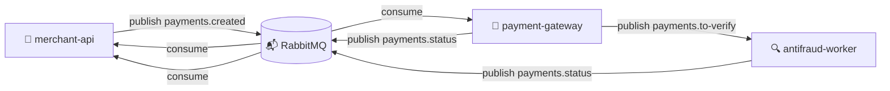

# 💳 Payment Gateway Simulator

> Projeto educacional e modular que simula o fluxo de um **gateway de pagamentos assíncrono**, aplicando **arquitetura event-driven** com **RabbitMQ** e **Spring Boot 3**.

## 🧠 Visão Geral

A aplicação é composta por **múltiplos microserviços independentes** que se comunicam via **mensageria (AMQP)**, representando o fluxo real de um gateway de pagamentos:


| Módulo | Descrição | Status |
|--------|------------|:------:|
| 🧾 **contracts** | Define os contratos e enums compartilhados entre os serviços | ✅ |
| 🏪 **merchant-api** | API do lojista — cria pagamentos e publica `payments.created` | ✅ |
| 🏦 **payment-gateway** | Processa eventos, aprova valores ≤ R$200 e encaminha demais à antifraude | ✅ |
| 🔍 **antifraud-worker** | Aplica regras de fraude e publica `payments.status` final (`APPROVED`, `DECLINED`, `ERROR`) | ✅ |

💬 Toda a comunicação entre serviços é **100% assíncrona**, baseada em **eventos JSON via RabbitMQ**, garantindo **desacoplamento, consistência eventual e escalabilidade**.

---

## ⚙️ Arquitetura



**Fluxo simplificado:**
1. O lojista cria um pagamento → `merchant-api` publica `payments.created`.
2. O `payment-gateway` decide:
    - Valores ≤ R$200 → **APPROVED** direto.
    - Valores > R$200 → envia para antifraude (`payments.to-verify`).
3. O `antifraud-worker` aplica regras:
    - Cartão em blacklist, valor > R$2000 ou merchant suspeito → **DECLINED**.
    - Caso contrário → **APPROVED**.
4. O resultado (`payments.status`) retorna ao `merchant-api`, que atualiza o pagamento no banco.

---

## 🧱 Stack

- ☕ **Java 21**  
- 🚀 **Spring Boot 3.3.x**  
- 💬 **RabbitMQ 3.13 (Management Plugin)**  
- 🧩 **Spring AMQP** (event-driven)
- 🗃️ **Spring Data JPA + H2** (para persistência no `merchant-api`)  
- 🧰 **Maven Multi-Module**  
- 🧱 **Docker Compose** (infra RabbitMQ)
- 🧪 **Postman Collection** (testes automáticos com polling)

---

## ▶️ Como Rodar Localmente

### 1️⃣ Subir o RabbitMQ
```bash
docker-compose up -d
```
Acesse o painel:
> [http://localhost:15672](http://localhost:15672)  
> **user:** guest **pass:** guest

---

### 2️⃣ Rodar os serviços

**Todos os módulos:**
```bash
# inicia merchant-api, gateway e antifraud (com dependência contracts)
mvn -pl contracts,merchant-api,payment-gateway,antifraud-worker -am spring-boot:run
```

**Portas padrão:**
| Serviço | Porta |
|----------|--------|
| merchant-api | 8081 |
| payment-gateway | 8082 |
| antifraud-worker | 8083 |

---

### 3️⃣ Criar um pagamento

```bash
curl -X POST http://localhost:8081/payments   -H "Content-Type: application/json"   -d '{
    "amount": 800.00,
    "currency": "BRL",
    "cardToken": "tok_ok",
    "merchantId": "MRC-001"
  }'
```

📤 O `merchant-api` publica `payments.created`.  
📨 O `payment-gateway` decide se aprova direto ou envia à antifraude.  
📥 O `merchant-api` recebe `payments.status` e atualiza o registro.

---

## 🧪 Testes com Postman

Uma **collection completa** foi criada para validar todos os cenários (inclui polling automático).

📦 Arquivos:
- `PaymentGatewaySimulator.postman_collection.json`
- `PaymentSimulator.postman_environment.json`

**Casos cobertos:**

| Cenário                          | Valor             | Resultado | Origem |
|----------------------------------|-------------------|------------|---------|
| Pagamento direto                 | ≤ R$200           | ✅ APPROVED | Gateway |
| Antifraude normal                | 201–2000          | ✅ APPROVED | Antifraud |
| Cartão blacklist                 | qualquer          | ❌ DECLINED | Antifraud |
| Valor > R$2000                   | >2000             | ❌ DECLINED | Antifraud |
| Merchant suspeito                | id termina com 999 | ❌ DECLINED | Antifraud |
| Valor negativo                   | "amount": -10.0       | ⚠️ **HTTP 400 (Bad Request)** — validação de entrada | Merchant API |
| Token inválido (vazio no evento) | "cardToken": ""   | ⚠️ **ERROR (PaymentStatusEvent)** | Gateway |

---

## 📂 Estrutura do Projeto

```
payment-gateway-simulator/
├─ docker-compose.yml            # RabbitMQ
├─ pom.xml                       # Parent multi-module
│
├─ contracts/                    # Eventos e enums
│   └─ br/com/payments/contracts/
│
├─ merchant-api/                 # API do lojista
│   ├─ domain/                   # Entidade Payment + Service + Repo
│   ├─ api/                      # Controller + DTOs
│   ├─ messaging/                # Rabbit config + listener/publisher
│
├─ payment-gateway/              # Processamento de pagamentos
│   ├─ domain/                   # Regras de decisão instantânea
│   ├─ messaging/                # Listeners + publishers
│
└─ antifraud-worker/             # Validação antifraude
    ├─ domain/                   # Regras de fraude (RulesEngine)
    ├─ messaging/                # Rabbit config + listeners
```

---

## 🧭 Roadmap

- ✅ `contracts` — eventos e enums
- ✅ `merchant-api` — criação e publicação
- ✅ `payment-gateway` — decisões automáticas
- ✅ `antifraud-worker` — regras de fraude
- ✅ Testes completos com Postman

---

## 🧾 Versionamento Profissional (Git Flow)

```
feature/* → develop → main → tag (release)
```

---

## 📜 Licença

Código aberto para estudo e demonstração de **arquitetura event-driven** com **Java + Spring Boot + RabbitMQ**.

---

## 🌟 Créditos

Desenvolvido por **Wesley Werikis**  
💼 [LinkedIn](https://www.linkedin.com/in/wesleywerikis/) 💻 [GitHub](https://github.com/wesleywerikis)
